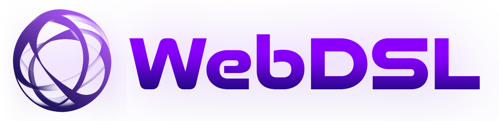

WebDSL is an external Domain-Specific Language (DSL) designed for generating full-stack applications. It integrates multiple data sources, including databases, message brokers, and REST APIs, while also supporting static components. At its core, WebDSL revolves around entities, which are linked to data sources, define the data model, and are utilized by components to visualize data.

The language emphasizes simplicity and ease of use, enabling developers to rapidly build applications without needing to manage low-level implementation details. At the same time, WebDSL is highly extensible, as it generates standard React and FastAPI code, making it easy to incorporate custom logic and advanced features when needed.

A typical WebDSL webpage is composed of connections, data sources, entities, components, and screens. For example, a connection might link to a MongoDB database, with a specific query defined in the data source. An entity then describes the structure of the data, and a component, such as a bar chart, can visualize that data. Screens bring everything together by defining layouts and specifying which components appear.

In summary, WebDSL is a powerful and flexible tool for rapidly developing full-stack applications, with a strong focus on data integration and visualization.

# Installation <a name="installation"></a>

Download this repository and simply install using the `install.sh`.

```
git clone https://github.com/giannisgkountras/web-dsl
cd web-dsl
./install.sh
```

This will install the WebDSL CLI tool and all the necessary dependencies. You can then use the `webdsl` command to validate, generate and transform your WebDSL models.

# Features

-   **Declarative Syntax**: Define data sources, entities and components and their relationships in a clear and concise manner.
-   **Extensible**: Easily add custom logic and components to fit your specific use case.
-   **Human-Readable**: Applications are defined in a way that is easy to understand and maintain.

Currently the DSL supports the following types of data sources:

-   **Message Broker**: MQTT, AMQP, Redis
-   **REST API**: REST API
-   **Database**: MongoDB, MySQL
-   **Static**: Static data

And the following types of components:

-   **Text**: Displays static or dynamic text content
-   **Image**: Renders an image from a given source
-   **Bar Chart**: Visualizes data using a bar chart
-   **Line Chart**: Visualizes trends over time with a line chart
-   **Pie Chart**: Displays proportional data in a pie chart format
-   **Table**: Shows structured data in a tabular format, allowind CRUD operations
-   **Live Table**: Real-time table that updates as new data arrives
-   **Form**: Collects user input and submits it to a data source
-   **Notification**: Displays alerts or status messages
-   **Gauge**: Represents a single numeric value within a range
-   **JSON Viewer**: Formats and displays JSON data for readability
-   **Alive Status**: Indicates the active status of a broker topic
-   **Publisher**: Sends messages to a broker topic
-   **Logs**: Displays real-time log messages from broker topics
-   **Progress Bar**: Visual indicator of progress
